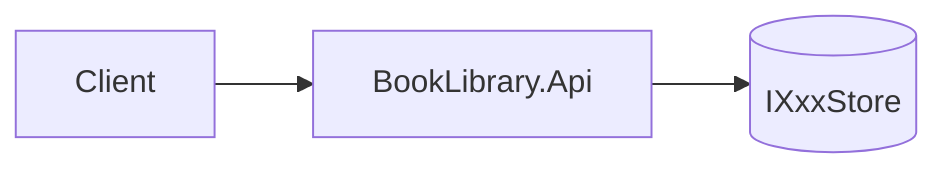
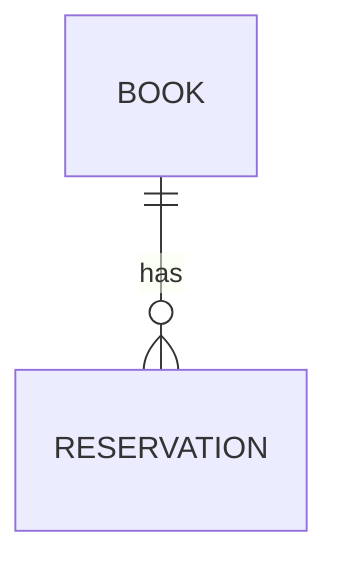
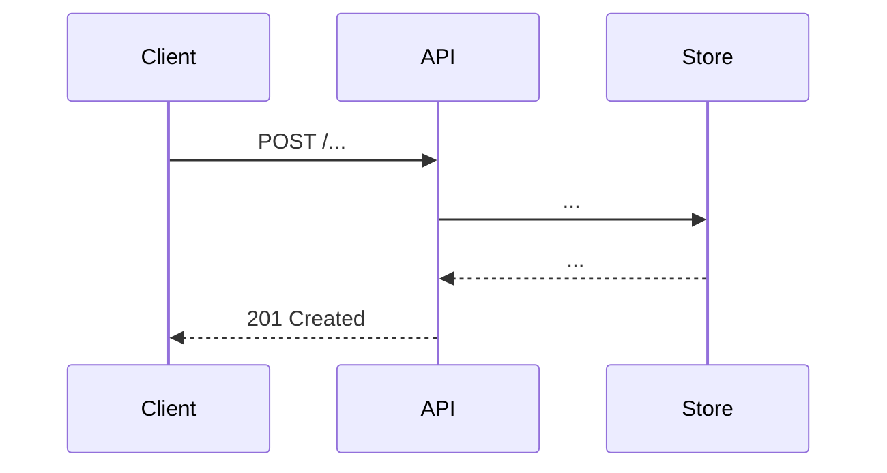

# Create Architecture

Translate an approved spec into a concrete, buildable design that fits this codebase.

## Steps

1. **Read the spec** at `docs/specs/<slug>/spec.md`. Confirm `Status:` is `reviewed` or `approved`. If not, stop and notify the user.
2. **Explore the codebase** for existing components/interfaces the design must integrate with (use `search` and `usages`).
3. **Write** `docs/specs/<slug>/architecture.md` using the template below.
4. **Self-check against the review checklist** in [`review-spec`](../review-spec/SKILL.md).
5. Offer the "Create implementation plan" handoff.

## Template

```markdown
# Architecture: <Feature title>

- **Spec:** [spec.md](./spec.md)
- **Status:** draft
- **Owner:** solution-architect
- **Created:** <YYYY-MM-DD>

## 1. Summary

2–3 sentences: what we're building and the chosen approach in one breath.

## 2. Components

| Component | Responsibility | Notes |
|-----------|----------------|-------|
| ... | ... | ... |



## 3. Data model

For each entity:

- **Name** — fields, types, identity, invariants.



## 4. API contract

For each endpoint:

- `METHOD /path` — purpose
  - Request: `{...}`
  - Response 2xx: `{...}`
  - Errors: 400 / 404 / 409 — when and why

## 5. Key flows

At least one Mermaid sequence diagram per non-trivial flow.



## 6. Failure modes & edge cases

- Invalid input → ...
- Concurrency / race → ...
- Not found → ...

## 7. Alternatives considered

- **Option A — <name>.** Rejected because ...
- **Option B — <name>.** Rejected because ...

## 8. Open technical questions

- [ ] ...

## 9. Acceptance criteria coverage

Map each spec acceptance criterion to the component/flow that satisfies it.

| AC # | Satisfied by |
|------|--------------|
| 1 | ... |
```

## Anti-patterns to avoid

- Introducing a database when the rest of the app is in-memory (unless the spec demands persistence).
- Adding layers (services, mappers, repositories) that wrap a single call.
- Speculative interfaces "for future extensibility".
