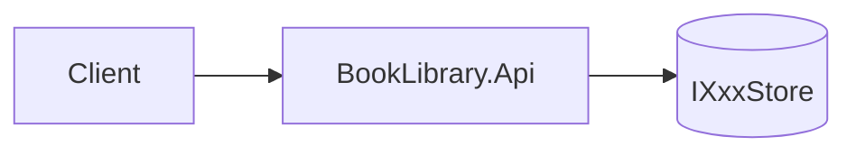
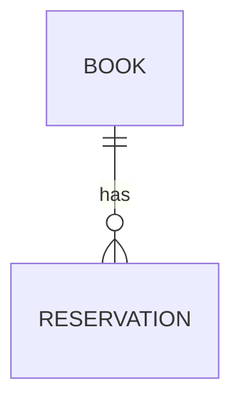
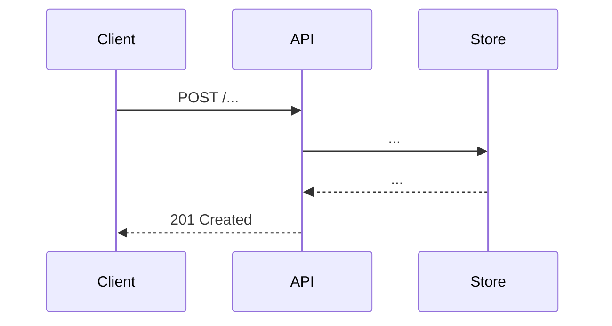

# Architecture: <Feature title>

- **Spec:** [spec.md](./spec.md)
- **Status:** draft
- **Owner:** solution-architect
- **Created:** <YYYY-MM-DD>

## 1. Summary

2–3 sentences: what we're building and the chosen approach in one breath.

## 2. Components

| Component | Responsibility | Notes |
|-----------|----------------|-------|
| ... | ... | ... |

## 3. Data model

For each entity:

- **Name** — fields, types, identity, invariants.

## 4. API contract

For each endpoint:

- `METHOD /path` — purpose
  - Request: `{...}`
  - Response 2xx: `{...}`
  - Errors: 400 / 404 / 409 — when and why

## 5. Key flows

At least one Mermaid sequence diagram per non-trivial flow.

## 6. Failure modes & edge cases

- Invalid input → ...
- Concurrency / race → ...
- Not found → ...

## 7. Alternatives considered

- **Option A — <name>.** Rejected because ...
- **Option B — <name>.** Rejected because ...

## 8. Open technical questions

- [ ] ...

## 9. Acceptance criteria coverage

Map each spec acceptance criterion to the component/flow that satisfies it.

| AC # | Satisfied by |
|------|--------------|
| 1 | ... |
