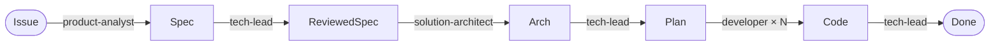

# spec-driven-demos

A walkthrough of **spec-driven development (SDD)** using GitHub Copilot custom agents and skills, driven by a tiny .NET 9 BookLibrary Web API.

> The point of this repo isn't the app — it's the **workflow**: how to turn a fuzzy GitHub issue into a spec, then an architecture, then a plan, then working code, each gated by review, and each step performed by a different Copilot agent persona.

## What's in here

```
.
├── src/BookLibrary.Api/          # .NET 9 Minimal API — the demo app
├── .github/
│   ├── copilot-instructions.md   # Repo-wide Copilot rules
│   ├── agents/                   # 4 personas (.agent.md)
│   └── skills/                   # 6 reusable skills (SKILL.md folders)
└── docs/
    ├── demo-script.md            # Step-by-step walkthrough
    └── specs/                    # Generated feature artifacts
```

## The workflow at a glance



| Step | Agent | Skill | Output |
|------|-------|-------|--------|
| 1 | `product-analyst` | `create-spec` | `docs/specs/<slug>/spec.md` |
| 2 | `tech-lead` | `review-spec` | Review section appended |
| 3 | `solution-architect` | `create-architecture` | `architecture.md` |
| 4 | `tech-lead` | `review-spec` | Review section appended |
| 5 | `tech-lead` | `create-implementation-plan` | `plan.md` |
| 6 | `developer` | `implement-task` | Code + tasks ticked |
| 7 | `tech-lead` | `validate-against-spec` | `validation.md` |

Personas are **few** (4) and persistent — they reflect actual job roles. Skills are **many** (6) and reusable — they're tasks any matching persona can invoke.

## Run the app

```bash
dotnet run --project src/BookLibrary.Api
# then GET https://localhost:7xxx/books
```

OpenAPI is exposed at `/openapi/v1.json` in Development.

## Run the demo

See [docs/demo-script.md](docs/demo-script.md).

## Credits

Inspired by the [github/awesome-copilot](https://github.com/github/awesome-copilot) community collection. Agents follow the VS Code [custom agents](https://code.visualstudio.com/docs/copilot/customization/custom-agents) format; skills follow the [Agent Skills](https://agentskills.io/) open standard.
