# Spec-Driven Development Demo Script

This walkthrough shows the spec-driven development (SDD) workflow end-to-end against a real feature: **Book Reservations** for the BookLibrary API.

> Prerequisites: this repo open in VS Code, GitHub Copilot enabled with custom agents/skills support, .NET 9 SDK installed.

## The cast

Four agents, six skills — pulled up from the chat agent picker:

| Agent | Persona | Owns |
|-------|---------|------|
| `product-analyst` | Business / requirements | Specs |
| `solution-architect` | Technical design | Architecture docs |
| `tech-lead` | Quality + planning | Reviews, plans, validation |
| `developer` | Implementation | Code |

Skills are tasks the agents perform: `create-spec`, `review-spec`, `create-architecture`, `create-implementation-plan`, `implement-task`, `validate-against-spec`.

## The flow

```mermaid
flowchart LR
  Issue([GitHub Issue]) -->|product-analyst<br/>create-spec| Spec[spec.md]
  Spec -->|tech-lead<br/>review-spec| ReviewedSpec[spec.md ✅]
  ReviewedSpec -->|solution-architect<br/>create-architecture| Arch[architecture.md]
  Arch -->|tech-lead<br/>review-spec| ReviewedArch[architecture.md ✅]
  ReviewedArch -->|tech-lead<br/>create-implementation-plan| Plan[plan.md]
  Plan -->|developer<br/>implement-task ×N| Code[(Code)]
  Code -->|tech-lead<br/>validate-against-spec| Done([validation.md ✅])
```



Each transition is a **handoff button** in the chat — defined in the `.agent.md` frontmatter — so the next agent + prompt is one click away.

---

## Step 0 — Show the starting state (30 sec)

1. Open the workspace. Point out:
   - `src/BookLibrary.Api/` — a tiny CRUD API for books.
   - `.github/agents/` — four persona files.
   - `.github/skills/` — six skill folders.
   - `.github/copilot-instructions.md` — repo-wide rules.
2. Run the API:
   ```bash
   dotnet run --project src/BookLibrary.Api
   ```
   Open the `.http` file or hit `GET /books` to show the seeded books.

## Step 1 — Open the feature issue (30 sec)

In the GitHub repo, open **Issue #1: Book reservations**. Read the issue out loud — it's intentionally a bit vague, the way real issues are.

## Step 2 — Issue → Spec (`product-analyst` + `create-spec`) (2 min)

In Copilot Chat:

1. Switch the agent picker to **product-analyst**.
2. Prompt:
   > Read issue #1 from `sam-cogan/spec-driven-demos` and use the `create-spec` skill to produce a spec.

Watch the agent:

- Read the issue.
- Create `docs/specs/book-reservations/spec.md`.
- Stop. Offer the **Review this spec** handoff button.

Point out:
- Acceptance criteria are Given/When/Then.
- "Non-goals" section is populated.
- Open Questions section flags anything ambiguous.

## Step 3 — Review the spec (`tech-lead` + `review-spec`) (1 min)

Click the **Review this spec** handoff.

- Agent appends a `## Review` section.
- Verdict is **Approve** or **Request changes**.
- If "Request changes" — point out the specific blockers, fix them with the `product-analyst`, re-review.

## Step 4 — Spec → Architecture (`solution-architect` + `create-architecture`) (3 min)

From the tech-lead's review message, click **Design the architecture**.

The architect:

- Reads the spec.
- Skims existing code (`Books/` folder).
- Produces `docs/specs/book-reservations/architecture.md` with:
  - Component table + Mermaid component diagram.
  - Data model + ER diagram.
  - API contract for new endpoints.
  - Sequence diagram for the reserve/return flow.
  - At least one rejected alternative.

Open the file in preview mode — the Mermaid diagrams render inline. This is the "wow" moment.

## Step 5 — Architecture review (`tech-lead` + `review-spec`) (1 min)

Re-invoke the tech-lead and ask for an architecture review using the same skill (`review-spec` works on either artifact). Approve it.

## Step 6 — Architecture → Plan (`tech-lead` + `create-implementation-plan`) (1 min)

Stay on the tech-lead. Prompt:
> Use `create-implementation-plan` to break this architecture into tasks.

You get `docs/specs/book-reservations/plan.md` — a checkbox list, ordered, with file paths and "Done when" checks per task.

Highlight:
- No task is "implement the feature".
- Domain types → store → endpoints → wire-up → smoke test.

## Step 7 — Implement (`developer` + `implement-task`) (5–8 min)

Click **Start implementation**. The developer agent:

- Opens `plan.md`, finds the first unchecked task.
- Implements just that one task.
- Runs `dotnet build`.
- Checks the task off.
- Stops and reports.

Repeat by saying **"next task"** (or set the agent loose — your call). After each task, the build is green and the plan has one more `[x]`.

During the demo you can:

- Live-edit the plan to insert a "wrong" task → show the dev surfaces it.
- Break the build deliberately → show it refuses to check off until fixed.

## Step 8 — Validate (`tech-lead` + `validate-against-spec`) (2 min)

Once all tasks are checked off, click **Validate against spec**.

The tech-lead:

- Builds the project.
- Runs the API (or test suite).
- Hits each new endpoint with `curl` / the `.http` file.
- Maps results to each AC in the spec.
- Writes `docs/specs/book-reservations/validation.md` with PASS/FAIL per criterion.
- Updates the spec's `Status:` to `implemented`.

If everything's green, you have a feature that demonstrably satisfies its spec — and a paper trail to prove it.

---

## What this demonstrates

- **Personas matter, skills are reusable.** Four agents, six skills — the tech-lead reuses `review-spec` for both spec and architecture review.
- **Handoffs make the flow visible.** Buttons appear in chat at each gate.
- **Tool restrictions enforce roles.** The `product-analyst` doesn't have code-running tools; the `developer` doesn't have authority to rewrite the spec.
- **Artifacts compound.** Spec → architecture → plan → code → validation — every step adds a reviewable file to the PR.
- **Build stays green.** Plans are small enough that every task lands a working build.

## Try it on the next issue

Issues #2 and #3 in the repo are unspecced features. Run the same workflow on them — solo or with the audience driving.
