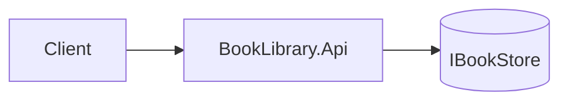
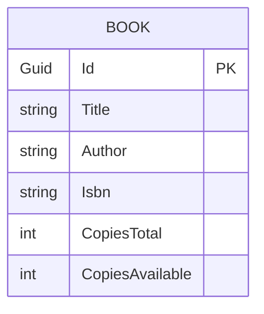
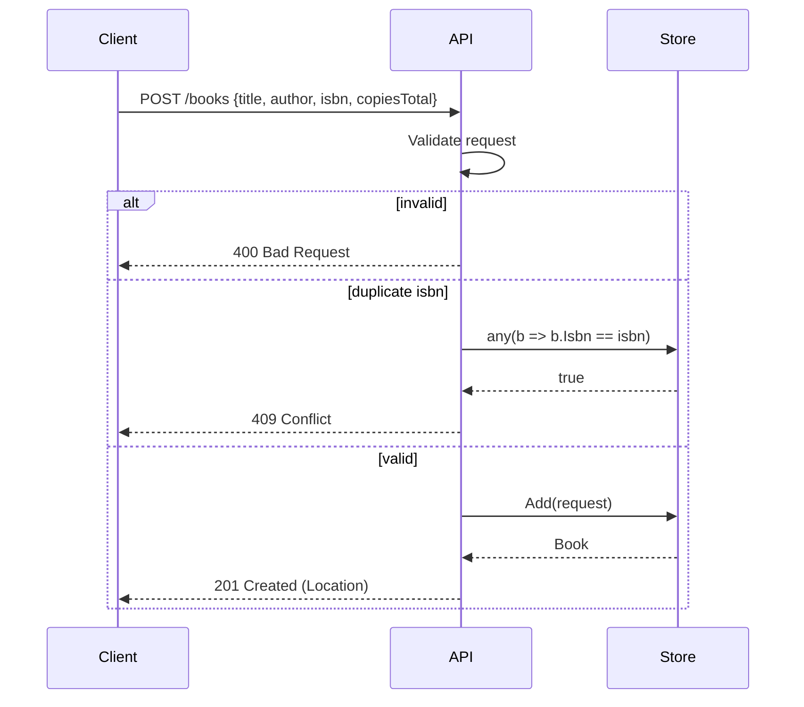

# Architecture: Books CRUD

- **Spec:** [spec.md](./spec.md)
- **Status:** implemented
- **Owner:** solution-architect
- **Created:** 2026-05-10

## 1. Summary

ASP.NET Core 9 Minimal API exposes a `/books` resource backed by a thread-safe in-memory store. A single `IBookStore` abstraction keeps the endpoints thin and lets tests swap implementations if needed.

## 2. Components

| Component | Responsibility | Notes |
|-----------|----------------|-------|
| `Program.cs` | Composition root; wires services and endpoints | Registers `IBookStore` as singleton |
| `BookEndpoints` | Maps HTTP verbs to store operations | Extension method on `IEndpointRouteBuilder` |
| `IBookStore` | Storage contract | `GetAll/GetById/Add/Update/Delete` |
| `InMemoryBookStore` | Concrete store | `ConcurrentDictionary<Guid, Book>`; seeds 3 books |
| `Book`, `CreateBookRequest`, `UpdateBookRequest` | DTOs and domain record | Records, immutable with `with` expressions |

## 3. Data model

- **Book** — `Id: Guid`, `Title: string`, `Author: string`, `Isbn: string`, `CopiesTotal: int`, `CopiesAvailable: int`.
  - Invariant: `0 <= CopiesAvailable <= CopiesTotal`.
  - Invariant: `Isbn` matches ISBN-10 or ISBN-13 format.

## 4. API contract

See [`docs/openapi.json`](../../openapi.json) for the machine-readable contract. Summary:

- `GET /books` → `200` array of `Book`.
- `GET /books/{id}` → `200` `Book` | `404`.
- `POST /books` (`CreateBookRequest`) → `201` `Book` + `Location` | `400` | `409` (duplicate ISBN).
- `PUT /books/{id}` (`UpdateBookRequest`) → `200` `Book` | `400` | `404`.
- `DELETE /books/{id}` → `204` | `404`.

## 5. Key flows

## 6. Failure modes & edge cases

- Empty body or non-JSON body → `400` from model binding.
- Concurrent writes → `ConcurrentDictionary` serialises per-key updates.
- `PUT` shrinking `CopiesTotal` below current `CopiesAvailable` → cap `CopiesAvailable` at new total.

## 7. Alternatives considered

- **EF Core + SQLite.** Rejected for demo simplicity.
- **Controller-based API.** Rejected; Minimal APIs match the small surface.

## 8. Open technical questions

- _(none)_

## 9. Acceptance criteria coverage

| AC # | Satisfied by |
|------|--------------|
| 1 | `GET /books` → `store.GetAll()` |
| 2, 3 | `GET /books/{id}` → `store.GetById` |
| 4, 5, 11 | `POST /books` → validation + `store.Add` |
| 6, 7, 8 | `PUT /books/{id}` → validation + `store.Update` |
| 9, 10 | `DELETE /books/{id}` → `store.Delete` |
